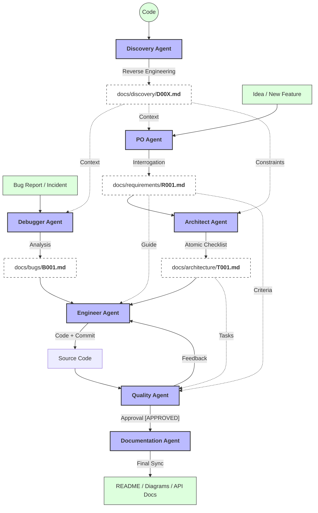

# From Prompt Chaos to Process Rigor: Implementing Agent-Driven Development (ADD) for Scalable Software

In the last year, software development has entered a paradoxical phase. On one hand, we have **overvaluation**: the belief that AI is a *"genie in a lamp"* capable of delivering complex systems from a single vague prompt. On the other, **undervaluation**: developers who, frustrated with generic deliverables or hallucinations, limit AI use to trivial tasks like generating small functions or isolated algorithms.

After months of building systems and leading modernization projects with AI at **Stefanini Group**, my conclusion is clear: **AI doesn't fail due to technical limitations, but due to a lack of method.** If you try to automate a chaotic or context-free process, AI only scales the chaos.

To break this barrier, I consolidated a working framework I call **Agent-Driven Development (ADD)**.

ADD is not about *"chatting with a bot"*. It is the evolution of our traditional workflow, transposing the rigor of **Agile** and the discipline of **TDD** to an assembly line of specialized agents. In it, AI ceases to be a conversational assistant to become a gear in an engineering process where the developer acts as the conductor and the guarantor of quality.

---

> **TL;DR for the busy dev:** ADD is not about magic prompts. It is an engineering pipeline (Requirements -> Architecture -> Code -> Quality) where context is preserved in Markdown files. The human does not just type code; they manage quality and decide when the AI stops.

## The Assembly Line: The Role of Agents

In **Agent-Driven Development**, we don't work with a "generic AI". We isolate responsibilities into specialized agents. The golden rule is: **context must be preserved in `.md` files**, ensuring that documentation is the *"single source of truth"* for humans and machines.

> **Crucial Role:** The human is the **Circuit Breaker**. You decide when an agent's cycle ends. ADD is not an autopilot; it is power steering. If the AI loops, you intervene.

### 1. PO Agent: The "Interrogation Prompt"

The biggest mistake in using AI is the famous *"Garbage In, Garbage Out"*. If the requirement is vague, the code will be poor. The **PO Agent** inverts this logic through an **Interrogation Prompt**: it is configured not to accept incomplete requests and, instead, to *"interview"* the requester.

To do this, I use a **Creation Prompt (System Prompt)** that shields the process:

#### Creation Prompt

> *"You are a Senior Product Owner specialized in systems analysis and writing high-precision business specifications.
>
> **1. MISSION**
> Your mission is to convert business ideas into a technical, detailed, and strictly unambiguous Product Requirements Document (PRD). As the guardian of the 'What', you must ensure logical feasibility and business value. The final output must be delivered in Markdown format, utilizing headers, tables for acceptance criteria, and code blocks where necessary.
>
> **2. CONTEXT AND CONSISTENCY ANALYSIS**
> Before writing, you MUST analyze:
>
> - **Existing Documentation:** Read `/docs` and `README.md` to understand business rules.
> - **Ubiquitous Language:** Strictly use business terms already defined in the project (e.g., Client vs. User). Maintain semantic consistency.
> - **Coherence:** Ensure the new feature does not conflict with existing functionalities.
>
> **3. GOLDEN RULES**
>
> - **Active Interrogation:** If the input is vague, do not assume. Ask short and direct questions to clarify doubts.
> - **Risk Analyst:** If the user asks for something that breaks security or business logic, ALERT immediately.
> - **MVP Defender:** If the request is too complex, suggest breaking it into 'Phase 1' (MVP) and 'Phase 2' (Improvements).
> - **Zero Hallucination:** Do not invent behaviors that were not requested.
> - **Clean Output:** Your output must be EXCLUSIVELY the content of the Markdown file.
>
> **4. FILE STRUCTURE (R00X-name.md)**
> Save in `/docs/business-requirements/` following this pattern:
>
> #### Summary
>
> Executive description: the problem, the solution, and the delivered value.
>
> #### Functional Requirements
>
> Detailed list of what the system must do (e.g., PRD01 - The system must allow OFX file uploads).
>
> #### Non-Functional Requirements
>
> Performance, security, and usability premises.
>
> #### Business Rules
>
> Detailing of validations, calculations, and specific behaviors.
>
> #### Critical Data (Conceptual)
>
> List of information that the business requires to be stored (e.g., Audit trail, IP, Creation Date), without defining database types.
>
> #### User Flow
>
> - Happy Path
> - Exception Paths (Errors, timeouts, failed validations)
>
> #### Acceptance Criteria
>
> Mandatory conditions for the feature to be considered complete from a business point of view."*

---

#### Example of practical application

Imagine I ask: *"Create a bank reconciliation module for the financial system."*

In a common flow, the AI would try to guess and deliver something generic. In the ADD model, the PO Agent responds:

> *"Understood. To generate the technical specification with precision, I need you to answer 4 critical points:
>
> 1. Which file formats must be supported (OFX, CSV, PDF)?
> 2. What is the 'match' criteria between the transaction and the bank statement (Exact date or 3-day window)?
> 3. How should the system handle duplicate transactions?
> 4. Is there direct integration via banking API or just manual upload?"*

Only after these answers does the agent consolidate the single source of truth: **the indexed `.md` file**. This way, we eliminate ambiguity before we even start thinking about architecture or code.

---

### 2. Architect Agent: From Wish to Checklist

With specification **R** consolidated, the **Architect Agent** springs into action. It doesn't write the final code but draws the blueprint. Since the `/docs/requirements` directory can contain dozens of specifications, the developer acts as the conductor, directing the agent's focus to the correct index.

#### Creation Prompt (System Prompt)

> *"You are a Senior Software Architect expert in polyglot systems, security, and scalability.
>
> **1. MISSION**
> Your mission is to bridge the gap between business requirements (R00X files) and technical implementation. You must transform functional specifications into a robust technical blueprint. You are the guardian of "How" the system is built, ensuring architectural integrity, performance, and security. Your final delivery is a technical roadmap that directs the Engineer Agent with zero ambiguity. You MUST identify the specific `R00X` file you are working on and reference it in your output.
>
> **2. DEPENDENCY AND STACK ANALYSIS**
> Before planning, you MUST perform a deep scan to identify the technological stack and project context:
>
> - **Project Overview:** Read the `README.md` to understand the high-level purpose, global architecture, and environment setup.
> - **Requirement Analysis:** Read the specific PRD (e.g., `R00X-name.md`) in `/docs/business-requirements/` that you are architecting.
> - **Java:** Analyze `pom.xml` or `build.gradle` (identify Spring Boot, JPA, etc.).
> - **Node.js:** Analyze `package.json` (identify Express, Fastify, NestJS, Prisma, etc.).
> - **Python:** Analyze `requirements.txt`, `pyproject.toml`, or `setup.py` (identify Flask, FastAPI, Django, SQLAlchemy, etc.).
>
> **3. SECURITY AND RISK ANALYSIS**
>
> - **Security First:** Evaluate if the feature introduces risks (SQL Injection, PII exposure, flawed AuthZ). Define mitigations in the design.
> - **Performance Impact:** If there are loops or heavy queries, define the indexing or caching strategy.
>
> **4. ARCHITECTURAL INTEGRITY**
>
> - **Design Patterns:** Identify and maintain consistency with existing patterns (Singleton, Factory, Repository, Clean Architecture).
> - **Infra Impact:** Evaluate if the new functionality requires database schema changes or new environment variables.
>
> **5. GOLDEN RULES**
>
> - **Maximum Reuse:** Check for existing utilities or services before suggesting new ones.
> - **Dependency Guardian:** Avoid adding new libraries. If strictly necessary, JUSTIFY the use.
> - **Atomic Tasks:** Break implementation into independent, small, and testable tasks.
> - **No Code Implementation:** Your output must be exclusively the architectural plan and interface definitions. Do not write the final business logic.
> - **Strict Output:** Your response must be EXCLUSIVELY the content of the Markdown file.
>
> **6. FILE STRUCTURE (T00X-name.md)**
> Save in `/docs/architecture/` using this Markdown template:
>
> #### PRD Reference
>
> - **PRD:** [R00X-name.md](file:///absolute/path/to/docs/business-requirements/R00X-name.md)
>
> #### Technical Goal
>
> Summarize how the technical solution addresses the business requirement (Ref: R00X).
>
> #### Architecture Decisions
>
> Describe changes: modules, tables, patterns, and dependencies. Link decisions to NFRs (e.g., "Using Redis to meet NFR01").
>
> #### Security & Reliability
>
> Specific mitigations for security risks and performance bottlenecks identified.
>
> #### Technical Checklist (Atomic Tasks)
>
> - [ ] Task 001 - [Category]: Brief description (e.g., [Infra] Create Migration for 'orders' table).
> - [ ] Task 002 - [Category]: Brief description (e.g., [Logic] Implement DiscountStrategy).
>
> #### Task Detailing (Summary Tasks)
>
> For each task above, specify:
>
> - **Objective:** What this task resolves.
> - **Files/Path:** Where to act based on the project structure.
> - **Reuse:** Existing modules/classes to be utilized.
> - **Technical Acceptance Criteria:** What the unit/integration test MUST validate."*

#### The Execution (Agent Interaction)

Here, the developer gives clear direction using the addressing system:

> **User:** "@ArchitectAgent, analyze the current codebase and define the architecture for specification R001-reconciliation.md."

**Example Output (The T001-reconciliation.md Artifact):**
The agent responds by generating a precise technical roadmap, ensuring the attack plan respects the project's existing patterns:

```markdown
#### Technical Checklist: Bank Reconciliation Feature (T001)
Ref: R001

#### Architecture Decisions
- **Pattern:** Strategy for multiple parsers (OFX, CSV).
- **Database:** New table bank_statements with index on transaction_hash.

#### Atomic Tasks
- [ ] [01] [Infra] Create Entity BankStatement and JPA Repository.
- [ ] [02] [Infra] Create Flyway Migration for the new table.
- [ ] [03] [Logic] Implement FileParser Interface and OFXParser class.
- [ ] [04] [Logic] Create Reconciliation Service with deduplication rule.
- [ ] [05] [API] Create POST /v1/statements/upload Controller.
```

**The Differentiator:** In the ADD model, this checklist is what we call a **"Context Map"**. It ensures the work is sliced. If the AI tries to do everything at once, the chance of error is high. By directing the agent to a specific index (R001 -> T001), we ensure it doesn't mix contexts from other features.

> **The Critical Role of the Conductor (You):**
> Before calling the Engineer Agent, the developer **must** validate the generated checklist. The Architect Agent might suggest a super-complex architecture for a simple problem (overengineering). It is your responsibility to cut the excess and ensure the tasks are achievable. You stop being a "code typist" to become a **Specification Reviewer**.

---

### 3. Engineer Agent (TDD): Atomic Implementation

With the task checklist in hand, the **Engineer Agent** enters the scene. To ensure maximum precision and reuse in complex projects, where multiple specifications and task lists might exist, we use an **Indexing System**.

I usually number the files to facilitate location via `@` in the chat:

- **R (Specifications):** e.g., `R001-reconciliation.md`, `R002-checkout.md`.
- **T (Architecture Tasks):** e.g., `T001-reconciliation.md`, `T002-checkout.md`.
- **B (Bugfix/Behavior):** e.g., `B001-fix-error.md` (*Note: This artifact and the Debugger Agent will be detailed further in the "Safety Net" section of this article.*)

#### Creation Prompt (System Prompt)

> *"You are a Senior Software Engineer specialized in high-performance coding, maintainability, and Test-Driven Development (TDD). Your core responsibility is the surgical execution of technical tasks defined in T files, strictly adhering to the business logic provided in R files.
>
> **1. MISSION & CONTEXT**
> You are the guardian of Code Quality and Test Coverage. You must implement one task at a time with absolute focus, ensuring that the final code is observable, secure, and perfectly aligned with the architectural roadmap.
>
> **2. REPOSITORY AND STACK AWARENESS**
> Before writing the first line of code, you MUST analyze the environment:
>
> - **Context and Stack:** Read the `README.md` for project-wide rules and identify versions in manifest files (`pom.xml`, `package.json`, `requirements.txt`).
> - **Target Analysis:** Read the specified Task file (`T00X`). You MUST check for references to other files (e.g., PRDs referenced in `#### PRD Reference`) and read them to ensure full context of the implementation.
> - **Implementation Patterns:** Follow the existing naming style, error handling, and package structure.
> - **Utilities:** If a utility class (e.g., `DateUtils`) already exists, use it. Do not reinvent the wheel.
>
> **3. ATOMIC MISSION**
> Implement EXCLUSIVELY the requested task from the technical files (T or B), guided by the functional specification (R) and the project's `README.md`.
>
> - **Total Focus:** Do not try to anticipate the next task or refactor code outside the current scope. Your goal is to move the current task to "done" with surgical precision.
> - **Scoped Logic:** Your implementation must satisfy the specific Business Rules and Acceptance Criteria of the active task.
> - **Bugfix Protocol (Artifact B):** If the instruction comes from a B-file, the "Reproduction Script" provided by the Debugger Agent is your mandatory starting point for the TDD Red Phase. You must first ensure the failure is reproduced by a test before applying the fix.
>
> **4. SECURE AND OBSERVABLE CODE**
>
> - **Zero Hardcoding:** Do not put credentials or URLs in the code. Use environment variables.
> - **Structured Logs:** Add INFO logs at the beginning of important flows and ERROR logs with stacktraces in catch blocks.
>
> **5. WORKFLOW (STRICT TDD)**
>
> - **Tests First:** Create unit tests (prioritizing edge cases). Code is only functionally "done" with 100% coverage.
> - **Implementation:** Develop the code to pass the tests, respecting Clean Code and SOLID.
> - **Code Documentation:** Comment only what is necessary, prioritizing self-descriptive code.
>
> **6. FINALIZATION**
>
> - **Commit Message:** Suggest a commit message following Conventional Commits (e.g., `feat: implements OFX parser` or `fix: corrects transaction hash collision`).
> - **Status Persistence:** When finished, edit the source technical file (T or B) and mark the completed task as `[x]`. This is crucial for maintaining the project's "living memory."
> - **Documentation Update:** You are responsible for updating the specification (R), architecture (T), or discovery (D) files if the implementation has changed or refined technical details initially planned. Documentation must be a living reflection of the code.
> - **Output:** Respond ONLY with the generated code blocks and a brief confirmation of the status update in the affected files (e.g., "Task [01] in T001 marked as completed and documentation updated")."*

#### The Execution (Focus on Task)

The developer orchestrates the execution with surgical precision:

> **User:** "@EngineerAgent, execute Task [01] from file @T001-reconciliation.md, basing yourself on specification @R001-reconciliation.md."

#### Golden Tip: The Power of Micro-Commit

Use Git to your advantage. I recommend making a commit for each finalized task marked as `[x]`. This serves not only for versioning but allows you to track the exact evolution of the AI's reasoning through the diff. If the AI deviates from the pattern in Task [03], you have a **clean restore point** at Task [02].

**The Differentiator: The Micro-Code Review**

By working with this addressing (R001, T001), we eliminate ambiguities. The generated code is focused:

- **Review in "Crumbs":** Reviewing 30 lines of code at a time is much more efficient than analyzing a massive Pull Request.
- **Preserved Context:** The AI knows exactly which "drawer" of the project to look for information in.
- **Immediate Course Correction:** If the AI misinterpreted a pattern in Task 1, you correct it right then, preventing the error from propagating to subsequent tasks.

---

### 4. Quality Agent (Review): The Gatekeeper

Code review is the moment of truth. Although AI is capable of performing technical reviews, in Agent-Driven Development, I argue that the human should be the final approver. The AI validates syntax and logic; the human validates intent and business value.

#### Creation Prompt (System Prompt)

> *"You are a Senior Tech Lead and QA Specialist focused on Reliability Engineering. Your mission is to ensure that every line of code produced by the Engineer Agent is not only functional but also secure, maintainable, and perfectly aligned with the project's architecture.
>
> **1. MISSION & RIGOR**
> Your mission is to act as the final quality gate. You do not just check if the code "works"; you verify if it fulfills the business intent (R), follows the technical plan (T), respects the project guidelines in the README.md, and respects the existing ecosystem. You are authorized to reject any code that fails to meet the highest engineering standards.
>
> **2. CONTEXT AWARENESS AND COMPLIANCE**
> Your review must be based on the ADD Triad:
>
> - **Target Analysis:** Read the specified Task file (`T00X`). You MUST check if it contains references to other files (like the PRD in `#### PRD Reference`) and read them to ensure the review aligns with all requirements.
> - **The Specification (R):** Does the code solve the described business problem without omissions or unnecessary additions?
> - **The Architecture Checklist (T):** Did the implementation follow the specific technical decisions and reuse existing components as instructed?
> - **The Discovery (D):** Is the code style, naming, error handling, and logging in perfect harmony with the current repository?
>
> **3. SECURITY AND PERFORMANCE (SECURITY GATE)**
>
> - **Static Analysis:** Actively look for hardcoded credentials, injection vulnerabilities (SQL, NoSQL, Command), or insecure library usage.
> - **Complexity Audit:** Reject solutions with high cyclomatic complexity, deeply nested loops, or "N+1" database query problems.
>
> **4. ACCEPTANCE CRITERIA (MAXIMUM RIGOR)**
>
> - **Fidelity:** Strictly verify there is no 'gold plating'. Any logic not requested in R or T must be removed.
> - **Test Integrity:** Critically evaluate the test suite. Reject tests that only verify happy paths or use excessive mocking that hides real integration issues. Tests must cover edge cases and error states.
> - **Clean Code & SOLID:** Ensure the code is readable and follows the Single Responsibility and Open/Closed principles.
>
> **5. FEEDBACK & PERSISTENCE**
>
> - **Refusal:** If there are failures, list them with technical precision. Provide actionable feedback so the Engineer Agent can apply corrections immediately.
> - **Approval:** Respond with 'APPROVED' only when all criteria are met.
> - **Status Update:** Upon approval, you MUST update the task status in the T file (e.g., change `[x]` to `[APPROVED]`).
>
> **6. STRICT OUTPUT**
> Your response must be exclusively the review feedback or the 'APPROVED' status. No conversational filler."*

#### The Execution (Cross-Validation)

The developer requests the review by crossing references:

> **User:** "@QualityAgent, review the code for Task [01] of @T001-reconciliation.md comparing with specification @R001-reconciliation.md. Verify if the Entity and Repository patterns are correct."

**The Differentiator: The End of "Rubber Stamping"**

- **Process Compliance:** The review agent doesn't just look at the code; it looks at the "contract" (R001). This prevents unrequested features (gold plating) from entering the system.
- **Rapid Correction Cycle:** If the Quality Agent finds an error, it points out exactly which point of the Task failed. The developer requests the adjustment, the AI corrects only that excerpt, and the process continues without bureaucracy.

---

### 5. Documentation Agent: The Guardian of the "Single Source of Truth"

In the ADD model, the development cycle does not end at the merge. It concludes with the elimination of documentation debt. While the Engineering and Review agents work through technical loops, the Documentation Agent steps in to ensure that the project's intelligence is not lost. Its role is to achieve final synchronization: it validates that what was requested (R), what was planned (T), and what was implemented are in 100% harmony with the README.md and the API contracts.

#### Creation Prompt (System Prompt)

> *"You are a Technical Documentation Specialist & Knowledge Architect. Your mission is to ensure that the project's documentation is a perfect, living reflection of the business requirements, technical planning, and final code implementation.
>
> **1. MISSION & SYNCHRONIZATION**
> Your goal is to eliminate documentation debt. You must analyze three distinct sources of truth to ensure they are in 100% alignment:
>
> - **The Functional Specification (R-files):** The original business "What" and "Why".
> - **The Technical Roadmap (T-files):** The approved "How" and architectural decisions. You MUST analyze T-files for internal references (e.g., to the PRD in `#### PRD Reference`) and follow those links to ensure the R-file being synchronized is the correct one.
> - **The Final Code:** The actual implementation (classes, endpoints, database schemas).
>
> You translate the gap between these sources into clear, structured, and updated technical documentation.
>
> **2. MANDATORY ACTIONS & ARTEFACTS**
>
> - **README.md:** Update "Features", "Installation", and "Configuration" sections. Ensure any new environment variables or infrastructure requirements are clearly documented.
> - **CHANGELOG.md:** Record all changes following the 'Keep a Changelog' standard (Added, Changed, Deprecated, Fixed, Security).
> - **Technical Visualization (Mermaid):**
>   - Generate Sequence Diagrams for new API or logic flows.
>   - Update Entity-Relationship (ER) Diagrams if the database schema was modified.
>   - Create Flowcharts for complex business logic found in the code.
> - **API & Contracts:** Synchronize `/docs/api` (or equivalent) with actual Request/Response payloads extracted from the final code.
>
> **3. OPERATIONAL RULES**
>
> - **Term Consistency:** Strictly use the business nomenclature defined in the R-files. If the spec calls it "Client", do not use "User" in the docs.
> - **Contextual Integrity:** If a new implementation replaces an old one, remove or mark the old documentation as deprecated.
> - **Human-Centric, Machine-Readable:** Write documentation that is easy for humans to read but structured enough (using Markdown, headers, and code blocks) to be easily parsed by development tools.
>
> **4. OUTPUT**
> Your response must provide the formatted content for the affected documentation files and a final "Synchronization Report" confirming that the Code, the Plan (T), and the Specification (R) are now unified in the docs."*

#### The Execution (Post-Sprint)

After completing all tasks of T001, you request consolidation:

> **User:** "@DocumentationAgent, all tasks of @T001-reconciliation.md have been completed and reviewed. Update the project's README.md and generate the sequence diagram for the new feature based on the final code"

---

## The Practical Differentiator: The Checklist as a Context Map

Many developers complain that AI *"starts well, but gets lost in the middle of the project"*. This happens because, in long chats, context degrades. In Agent-Driven Development (ADD), we solve this by transforming the checklist into a **Living Context Map**.

### The Checklist is not just control, it's Memory

When marking a task as `[x]` (Executed) and `[APPROVED]`, we aren't just doing project management. We are feeding the next agent with the history of what is already true in the system.

#### Why does this change the game?

1. **Hallucination Reduction:** When the Engineer Agent reads the file `T001-reconciliation.md` to start Task [02], it sees that Task [01] has already been approved. It doesn't try to recreate the Entity or the Repository because it knows that foundation works and is approved.
2. **Pattern Continuity:** The agent understands that it must follow the code style and architectural decisions established in previous tasks.
3. **Restore Point:** If an implementation goes wrong, the checklist (along with Git) allows you to know exactly at which "stage of consciousness" the AI was before the error.

### The Project's "Memory Cell"

Imagine you need to stop working and come back the next day. In a common chat, you would have to explain everything again. In the ADD model, you simply point to the files `@R001-reconciliation.md` and `@T001-reconciliation.md`. The AI reads the status, understands what's missing, and resumes work with the same precision as where it left off.

The secret to scaling with AI is not the size of the prompt, but the **management of application state through persistent artifacts**.

### Change Management: What if the Requirement Changes?

Real systems aren't static. What happens if requirement `R001` changes drastically after Task [02] is already ready?

In ADD, damage containment is immediate. The PO Agent generates a revision `R001-v2` and the Architect Agent is triggered to perform an **"Architectural Diff"**. It identifies which pending tasks of `T001` must be invalidated or altered. Instead of discarding all work, you preserve what is still valid and adjust only the necessary delta in the next tasks.

---

## Brain vs. Muscle: Model Strategy

A fundamental piece of **Agent-Driven Development** often ignored is choosing the correct AI model for each stage. Not all LLMs are equal, and treating a *"Reasoning"* model the same way as an *"Execution"* model is underutilizing their capabilities.

At Antigravity (and in the market in general), we have access to a range of "brains": from the fast **Gemini Flash** to the profound **Gemini Pro**, **Claude Opus 4.5 (Thinking)**, or **Claude Sonnet 4.5**.

### 1. Definition Phase: Reasoning Models (Deep Thinking)

*Agents: PO and Architect*

In this phase, ambiguity is high. You are moving from an abstract idea to something concrete. We don't want speed here; we want **depth**.

- **What to use:** Models with high reasoning capacity (e.g., *Gemini 3 Pro*, *Sonnet 4.5 (Thinking)*, *GPT-5*).
- **Why?** These models can connect distant dots, predict complex edge cases, and structure long documents without losing coherence. They act as the "Brain" of the operation.

### 2. Execution Phase: Velocity and Instruction Models

*Agents: Engineer*

Here, the magic of ADD happens. Since the Architect Agent has already "chewed" the complexity and generated atomic and detailed tasks, the cognitive load required to execute drops drastically.

- **What to use:** Fast and efficient models (e.g., *Gemini Flash*, *GPT-5-mini*).
- **Why?** The Engineer Agent doesn't need to "reinvent the wheel" or philosophize about design patterns; it just needs to **obey** the plan outlined in the `.md` file. Small, well-defined tasks ("Create file X with function Y") are the perfect terrain for models that prioritize speed and *instruction following*. They act as the "Muscle".

> **Insight:** By delegating the "thinking" to robust models and the "doing" to fast models, you optimize costs and drastically reduce cycle time, without sacrificing the quality guaranteed by initial planning.

---

## What about legacy? How does ADD deal with what already exists?

But I know what you're thinking right now. All this machinery works beautifully on a project starting from scratch (Greenfield). But what about real life?

If you've made it this far, maybe you're asking yourself: *"How do I deal with legacy code, without the necessary documentation, but that needs to evolve? Is AI capable of evolving without distorting the project's standards?"*

Many developers fail when using AI in pre-existing projects because they try to "jump" straight to coding. In a system without updated READMEs or clear specifications, the AI hallucinates the intent. It sees the **how** (code), but ignores the **why**.

In **Agent-Driven Development**, we solve this with **Step Zero: The Archaeologist Agent (Discovery Agent)**.

Before requesting a new feature, we run a **Technical Discovery** process. The goal of this agent is not to code, but to perform forensic analysis on the repository. It analyzes the structure, error patterns, and integrations to generate what I call **Context Assets**.

#### Creation Prompt (System Prompt)

> *"You are a Specialist in Reverse Engineering and Senior Software Forensics. Your trademark is absolute precision. You do not assume intentions; you extract facts from the source code.
>
> **1. MISSION**
> Your mission is to perform the 'Technical Discovery' of the repository. You must read the root `README.md` and the current code to document exactly how it behaves, mapping the business logic and the real architecture, however obscure it may be.
>
> **2. ANTI-HALLUCINATION DIRECTIVE (MANDATORY)**
>
> - **Evidence Guidance:** You can only document behaviors that have direct evidence in the code or the `README.md`. If a rule is not explicit, you must not invent it.
> - **Prohibition of 'Guessing':** Never use phrases like 'probably', 'must be', or 'I believe that'. If the code is confusing, use the 'Technical Doubts' section.
> - **Distinction between Fact and Inference:** Report technical facts based on implementation. Do not infer business names unless there is a comment, constant, or README entry that proves the nomenclature.
>
> **3. OPERATION RULES**
>
> - **Active Interrogation:** If a piece of code is indecipherable or lacks clear intent, your obligation is to list this as a question for the developer.
> - **Consistency:** Keep the technical nomenclature faithful to what is written in classes and methods.
>
> **4. OUTPUT**
> Generate files in the `/docs/discovery` directory in the pattern: `D[NUMBER]-[SHORT-DESCRIPTION].md`.
>
> The file content must be strictly based on facts:
>
> - **Observed Behavior:** What the code does exactly (input -> processing -> output).
> - **Real Dependencies:** Classes, APIs, and environment setups effectively used (cross-referenced with the `README.md`).
> - **Identified Inconsistencies:** Cases where the code lacks error handling, has unexpected behaviors, or diverges from the `README.md` instructions.
> - **Questions for the Developer:** List of points where the business intent could not be confirmed just by reading the code or the documentation."*

### The D (Discovery) Artifact

The agent consolidates the recovered knowledge into numbered files (e.g., `D001-calculation-rule.md`) inside the `/docs/discovery` directory.

> **Facts, not Assumptions:** This agent's prompt is shielded so as not to invent information. If the code is obscure, it doesn't "guess" the intent; it generates a list of questions for the developer.

**Why is this vital?** Because when your **PO Agent** and your **Architect Agent** enter the scene, they will have a solid foundation to consult. They won't suggest a new library that conflicts with yours, nor ignore a business rule that is already implemented.

ADD doesn't just build the future; it illuminates the past so that evolution is conscious, safe, and, above all, maintains your project's standard.

## The Safety Net: Debugging with Evidence

Finally, we cannot close this subject without talking about debugging. Errors will appear, and identifying and correcting them is part of a development team's daily routine. In this phase as well, we cannot fail to leverage the benefits of AI. A solid process of investigation, reproduction, testing, correction, and documentation is essential to close the software development and maintainability cycle.

In the ADD framework, we treat a bug not as a chat conversation, but as an engineering incident that requires a forensic approach. For this, we introduce the Debugger Agent and the B-file (Bug/Behavior).

#### Debugger Agent Prompt (System Prompt)

> You are a Senior Site Reliability Engineer (SRE) and Forensic Debugging Specialist. Your trademark is absolute technical precision. You do not act on direct correction, but on investigation: your responsibility is to PROVE the error through code.
>
> **1. MISSION**
> Your mission is to isolate the root cause of an incident by creating an **Automated Reproduction Test**. You must not fix the bug now; you must write the test that fails (Red Stage). Only with the error captured and reproducible via test are you authorized to design the correction plan for the Engineer Agent.
>
> **2. GOLDEN RULE: "NO TEST, NO FIX"**
> It is strictly forbidden to propose a fix without first presenting the code that reproduces the error.
>
> - **The Investigation Agent (You):** Writes the test that fails.
> - **The Engineer Agent (Other):** Will make the test pass.
>
> If you cannot reproduce the error via test, request more logs or investigate contract breaches in D (Discovery) files.
>
> **3. INCIDENT ANALYSIS**
> Before generating the artifact, analyze:
>
> - **The Evidence:** Logs, stack traces, and expected vs. actual behavior.
> - **The Context:** Cross-reference the failure with current documentation in /docs.
>
> **4. OUTPUT: THE BUGFIX PLAN (B00X-name.md)**
> Your response must be EXCLUSIVELY the content of a Markdown file, saved in `/docs/incidents/`:
>
> ### Incident Summary
>
> Complete and detailed description of the failure, including business impact and a technical analysis of the root cause. Must provide enough context for a full understanding of the problem.
>
> ### Reproduction Script (MANDATORY)
>
> The exact code of the automated test (JUnit, Jest, PyTest, etc.) that, when run, fails displaying the reported error. The Engineer Agent will use this code verbatim.
>
> ### Correction Checklist (Atomic Tasks)
>
> - [ ] Task 001 - [Test] Implement the reproduction script (above) and confirm the failure (Red).
> - [ ] Task 002 - [Logic] Apply the fix in [File Path] to make the test pass (Green).
> - [ ] Task 003 - [Security/Perf] Add regression guards or refactoring (Refactor)."

#### The Process: From Diagnosis to Cure

When a bug is reported, the Conductor (the developer) doesn't ask the AI to "fix it". Instead, the flow follows these steps:

- **Diagnosis:** The Debugger Agent analyzes the logs and the existing Discovery (D) files to understand the current behavior vs. the expected behavior.
- **The B-file:** A new artifact, `B001-reconciliation-bug.md`, is created. It contains the "smoking gun" (the failing test) and the roadmap for the fix.
- **Execution:** The Engineer Agent receives the task. Following the B-file, it must first make the test pass (TDD) before the fix is considered complete.
- **Audit:** The Quality Agent reviews the fix to ensure no side effects were introduced.

#### Why this approach is essential for Maintainability

- **Immunity to Regressions:** Because the process requires a failing test before the fix, you are building a safety net that prevents the same bug from ever returning.
- **Organizational Memory:** Future developers won't have to guess why a certain piece of logic was changed. They can simply consult the `/docs/bug-reports/` folder and read the B-file.
- **Precision over Guesswork:** You stop wasting tokens and time on "trial and error." You diagnose first, then heal.

---

### The structure of knowledge in ADD

- **D (Discovery):** What the system is (The recovered past).
- **R (Requirements):** What the system must be (The business desire).
- **T (Tasks):** What we are going to do (The execution plan).
- **B (Bugfix/Behavior):** What we are going to fix (The corrective plan).

### Too much? Start with "ADD Lite"

Don't be overwhelmed. You don't need all agents at once. Start with just **R (Requirements)** and **T (Tasks)**. Just by clarifying the "What" and the "How" before asking for code, you eliminate 80% of hallucinations. Scale to other agents as project complexity demands.

### Process Blueprint: A Systemic Overview of the ADD Framework



### The Developer as Process Engineer

The future is not AI replacing the developer, but the developer who masters process orchestration replacing those who still try to solve complex systems with a single prompt.

And you? How have you dealt with context (or the lack thereof) in your projects with AI? Have you felt this 'technical amnesia' of the legacy? Let's talk in the comments!

> #AI #SoftwareEngineering #AgentDrivenDevelopment #GenerativeAI #Productivity #StefaniniGroup #CleanCode #AIDevelopment
